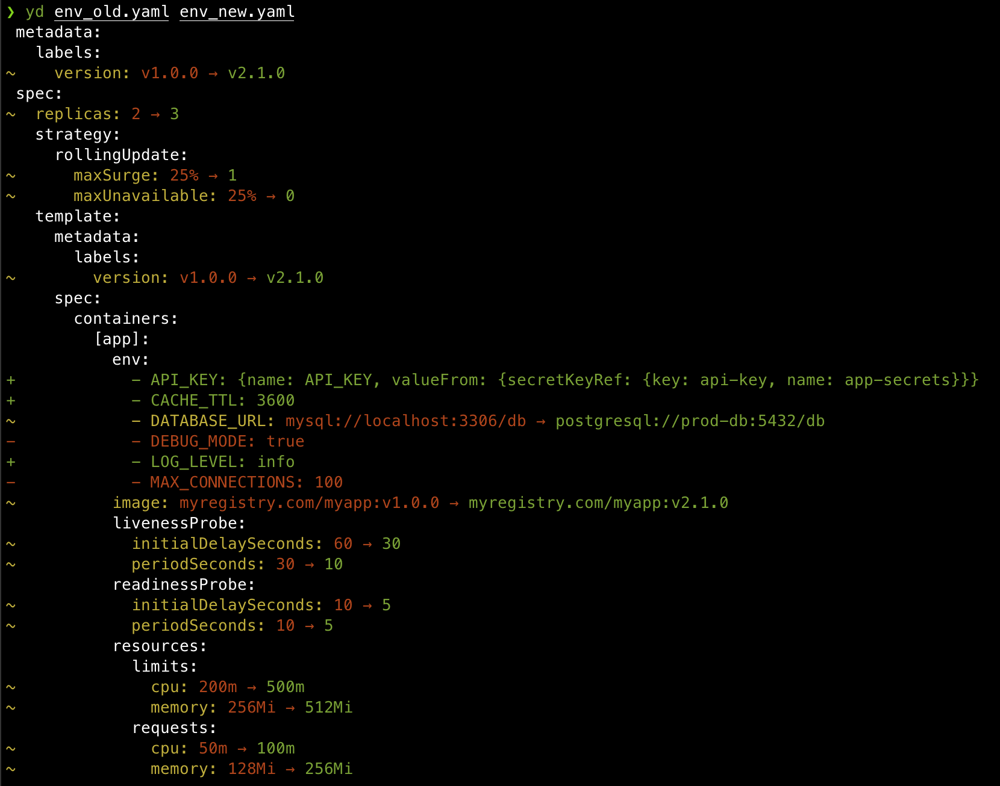

# yd - YAML Diff Tool

[](https://www.python.org/downloads/)
[](https://opensource.org/licenses/MIT)



**yd** is an intelligent YAML comparison tool that understands YAML structure and provides clear, colored output showing additions, deletions, and modifications. It features smart list sorting to avoid false differences when comparing lists of dictionaries, and can intelligently parse and compare YAML content within multiline strings (literal blocks). This makes it perfect for comparing Kubernetes manifests, Helm charts, configuration files, and any YAML documents containing embedded configuration.

## Features

- **Smart List Sorting**: Automatically sorts lists of dictionaries by common keys (like `name`) to avoid order-dependent differences
- **Colored Output**: Clear visual indication of additions (green), deletions (red), and modifications (yellow) with ANSI color codes
- **Tree Structure**: Groups differences by YAML hierarchy for better readability
- **Multiline YAML String Diffing**: Intelligently parses and compares YAML content within multiline strings (literal blocks with `|`)
- **Environment Variable Handling**: Special formatting for Kubernetes environment variables
- **Multiple Output Formats**: Full diff, counts only, or paths only
- **Exit Codes**: Can return non-zero exit codes when differences are found

## Installation

### From source

```bash
git clone https://github.com/acze/yd.git
cd yd
pip install .
```

### Direct download

You can also download `yamldiff.py` directly and run it with Python:

```bash
python yamldiff.py file1.yaml file2.yaml
```

### Install from Git

You can install directly from the Git repository:

```bash
pip install git+https://github.com/acze/yd.git
```

## Usage

### Basic Usage

```bash
# Compare two YAML files
yd file1.yaml file2.yaml

# Or if running directly
python yamldiff.py file1.yaml file2.yaml
```

### Command Line Options

```bash
yd [OPTIONS] LEFT_FILE RIGHT_FILE

Options:
  --color [always|never|auto]  When to use color output (default: auto)
  --version                    Show version number and exit
  -c, --counts                 Display summary count of differences
  -e, --exit-code              Exit with non-zero status when differences are found
  -p, --paths-only             Show only paths of differences without values
  -h, --help                   Show this help message
```

### Examples

#### Basic Comparison
```bash
$ yd old-deployment.yaml new-deployment.yaml
spec:
  template:
    spec:
      containers:
      - name: app
        resources:
          limits:
          ~ cpu: 1 → 2
          ~ memory: 2Gi → 4Gi
```

#### Show Only Counts
```bash
$ yd --counts config1.yaml config2.yaml
Added: 3, Removed: 1, Modified: 5
```

#### Show Only Paths
```bash
$ yd --paths-only manifest1.yaml manifest2.yaml
~ spec.template.spec.containers[app].resources.limits.cpu
+ spec.template.spec.containers[app].env[NEW_VAR]
- spec.template.spec.containers[app].env[OLD_VAR]
```

#### Environment Variables (Special Formatting)
```bash
$ yd deployment-v1.yaml deployment-v2.yaml
spec:
  template:
    spec:
      containers:
      - name: app
        env:
        ~ - DATABASE_URL: mysql://old → mysql://new
        + - REDIS_URL: redis://localhost:6379
```

#### Multiline YAML String Diffing
```bash
$ yd config-old.yaml config-new.yaml
data:
~  app.yaml: |
    features:
      logging: true
      metrics: false
  →
    features:
      logging: true
      metrics: true
      tracing: false
```

When the tool encounters YAML content within multiline strings (literal blocks), it parses the content and shows detailed diffs with color coding for each line. In the above example, `metrics: false` is shown in yellow (modified) in the old content, `metrics: true` is shown in yellow in the new content, and `tracing: false` is shown in green (added).

#### Disable Colors
```bash
$ yd --color=never old.yaml new.yaml
```

#### Show Version
```bash
$ yd --version
yd 0.1.0
```

#### Use in Scripts (with exit codes)
```bash
#!/bin/bash
if yd --exit-code --counts old.yaml new.yaml; then
    echo "No differences found"
else
    echo "Differences detected"
fi
```

## Smart List Sorting

Unlike traditional diff tools, `yd` intelligently handles lists of dictionaries. When comparing lists where all items share common keys, it sorts them by those keys to avoid false differences due to ordering.

For example, these two YAML files are considered identical:

**file1.yaml:**
```yaml
env:
- name: DATABASE_URL
  value: mysql://db
- name: REDIS_URL
  value: redis://cache
```

**file2.yaml:**
```yaml
env:
- name: REDIS_URL
  value: redis://cache
- name: DATABASE_URL
  value: mysql://db
```

## Output Format

The output uses a tree structure that groups differences by their YAML hierarchy:

- `+` - Added items (green)
- `-` - Removed items (red)
- `~` - Modified items (yellow)

The tool shows the complete path to each difference and formats complex values (dictionaries and lists) using proper YAML indentation.

For multiline YAML strings (literal blocks with `|`), the tool intelligently parses the content and shows detailed line-by-line diffs with color coding:

- **White**: Unchanged lines
- **Yellow**: Modified lines
- **Green**: Added lines
- **Red**: Removed lines

The format displays the old content, an arrow (`→`), and the new content with appropriate coloring for each line.

## Use Cases

- **Kubernetes Manifests**: Compare deployment specs, config maps, and secrets (including ConfigMaps with embedded YAML)
- **Helm Charts**: Validate chart changes and upgrades
- **Configuration Files**: Track configuration drift, especially files with embedded configurations
- **CI/CD Pipelines**: Automated validation of YAML changes
- **Git Diffs**: Better visualization than traditional text diffs
- **Embedded YAML**: Compare YAML documents containing literal blocks with nested configuration

## Requirements

- Python 3.8+ (tested on 3.8-3.14)
- PyYAML

## Contributing

Contributions are welcome! Please feel free to submit a Pull Request.

## License

Copyright (c) 2025 Szymon Kośla

MIT License - see [LICENSE](LICENSE) file for details.
